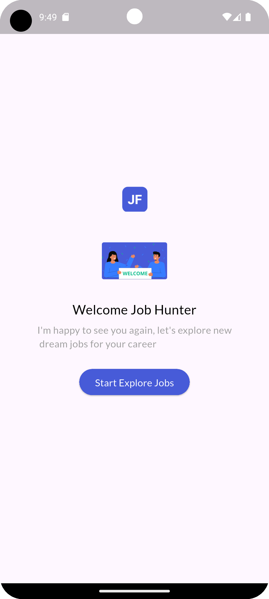
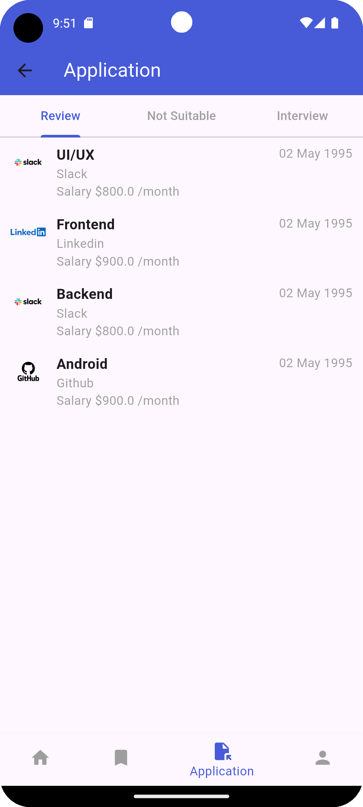
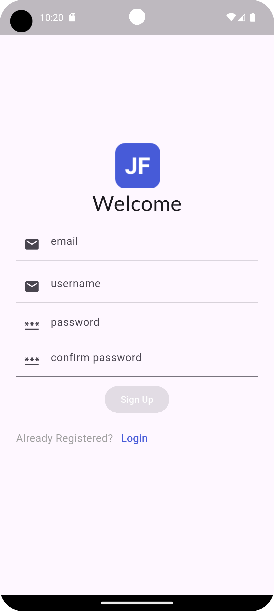

# 🧭 Job Finder App

A **Flutter-based Job Finder App** integrated with **Firebase**, featuring a clean UI and basic functionalities. This is a practice project that uses **dummy data** to simulate job listings and user interactions.

---

## 🚀 Features

- ✨ Beautiful splash and onboarding experience  
- 🔐 Firebase authentication (signup/login)  
- 👤 User registration with email and password  
- 📋 Dummy job list display after login     

---

## Screenshots

| Splash Screen | Login | Welcome | Application View | Signup |
|---------------|-------|---------|------------------|--------|
|  |  |  |  |  |

> 📌 **Note:** Images must be placed in your project at `assets/screenshots/` with the exact filenames:
> - `splash_screen.png`
> - `login.png`
> - `welcome.png`
> - `signup.png`
> - `application_view.png`

---
